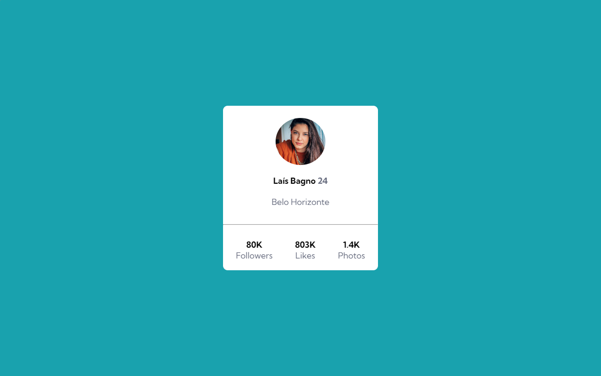
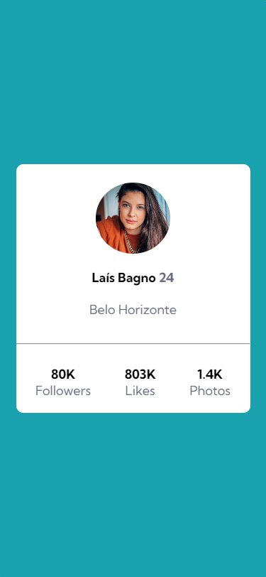

<h1 align="center"> Profile Card </h1>

<h2 align="center">This project is an example of a social media profile card, made with HTML and CSS.</h2>

 

Desktop image:

Mobile image:

---
## 💻**How was it done?**
This project is a challenge from [Frontend Mentor](https://www.frontendmentor.io/challenges/profile-card-component-cfArpWshJ), I was inspired by the layout and created the project using CSS FlexBox and CSS Grid techniques.

  

### 🎨 **Project Colors**:
- Background-color: `hsl(185, 75%, 39%)`
- Text-color: `hsl(227, 10%, 46%)`
- Card-color: `#fff`

  

### ⚡ Access the [project online]()

---
### 💎 Follow me on [linkedin](https://www.linkedin.com/in/laisbagno/)

# Card-Profile
# Card-Profile
